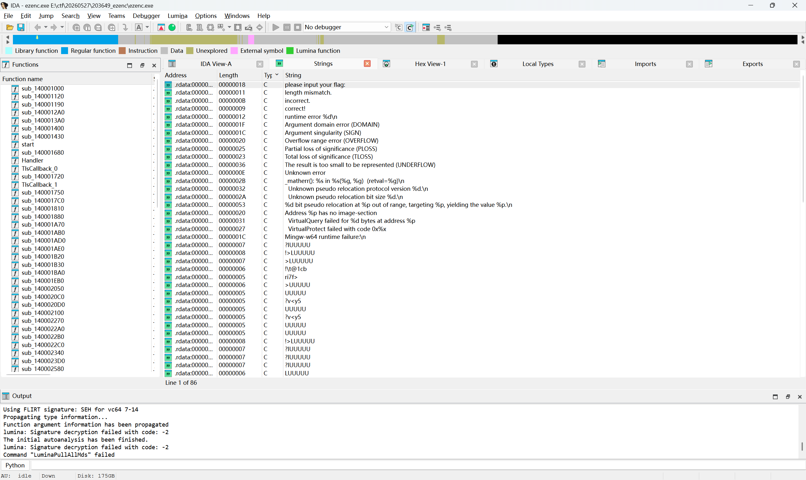
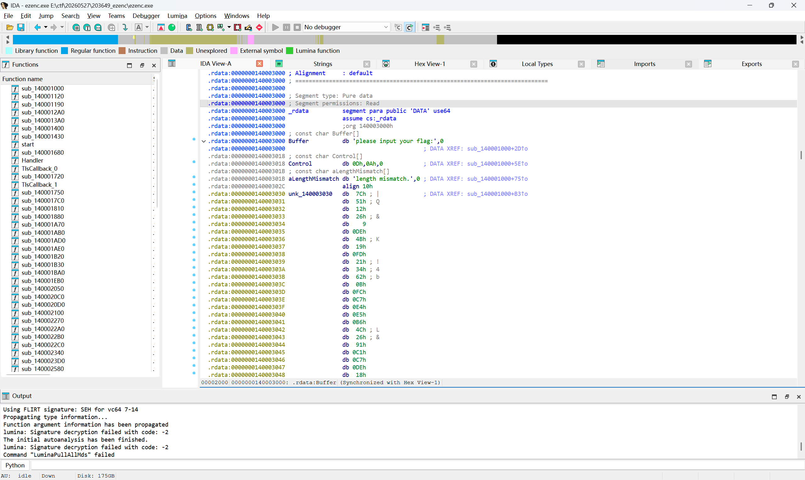
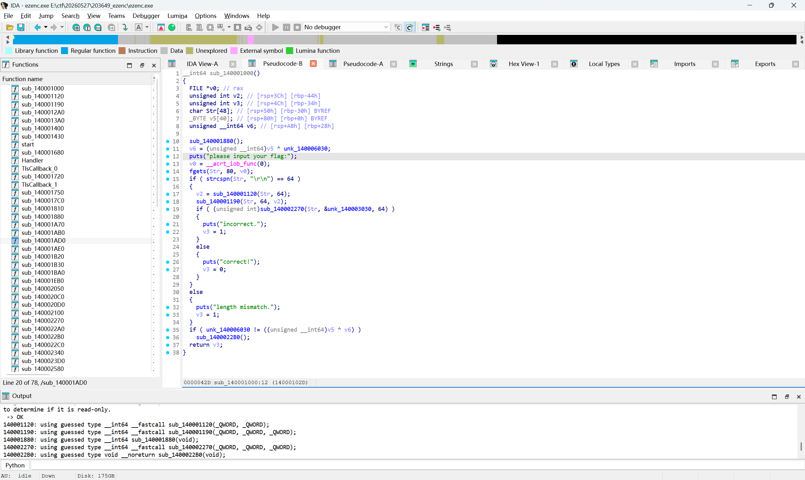
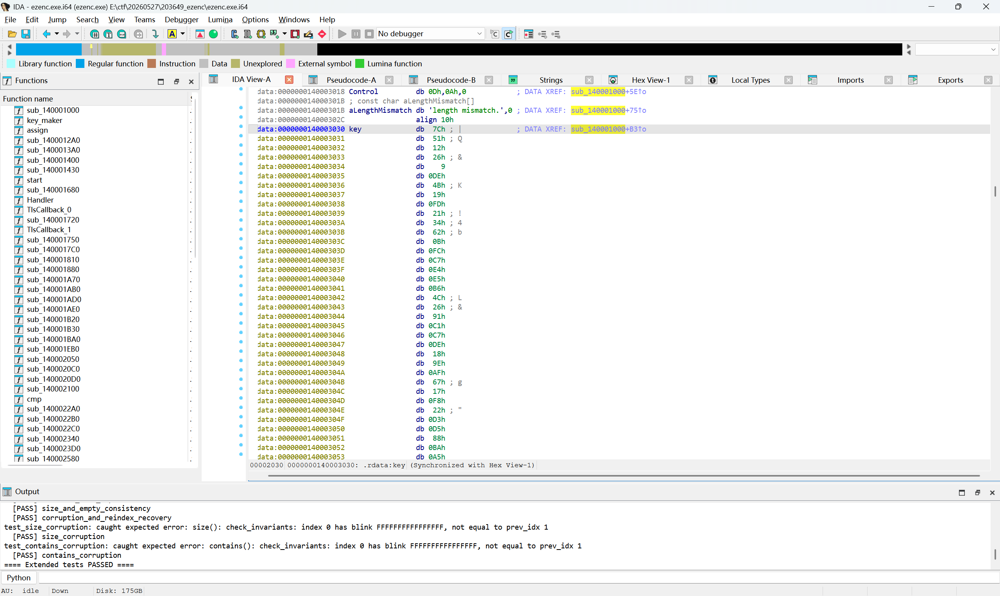
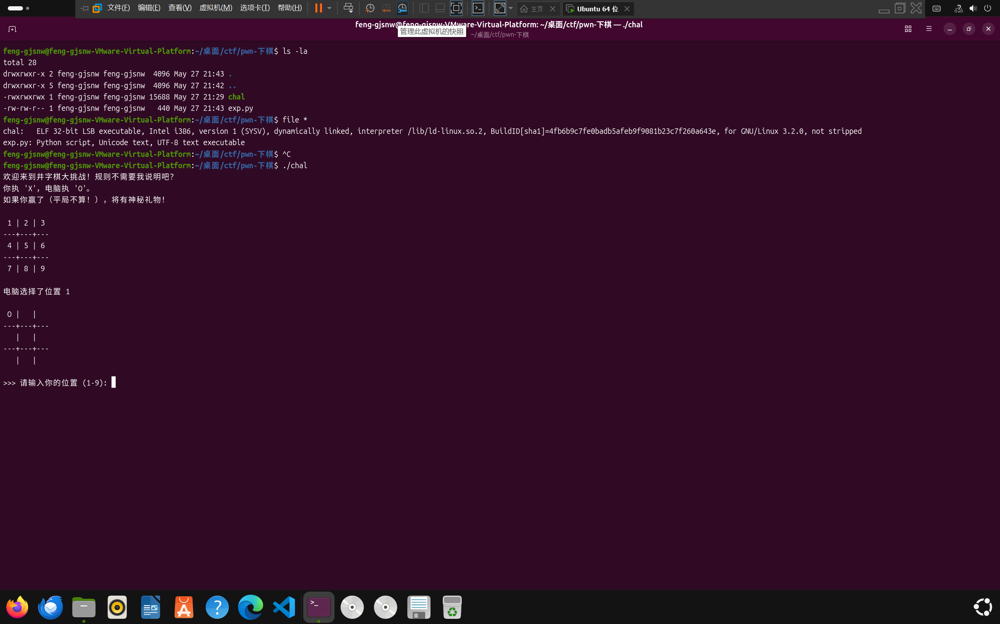
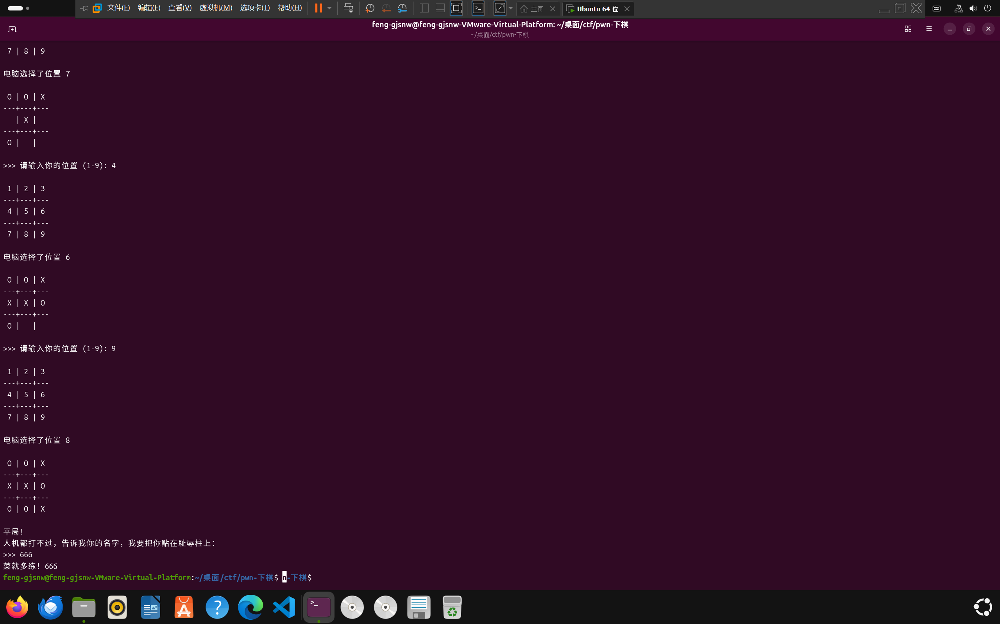
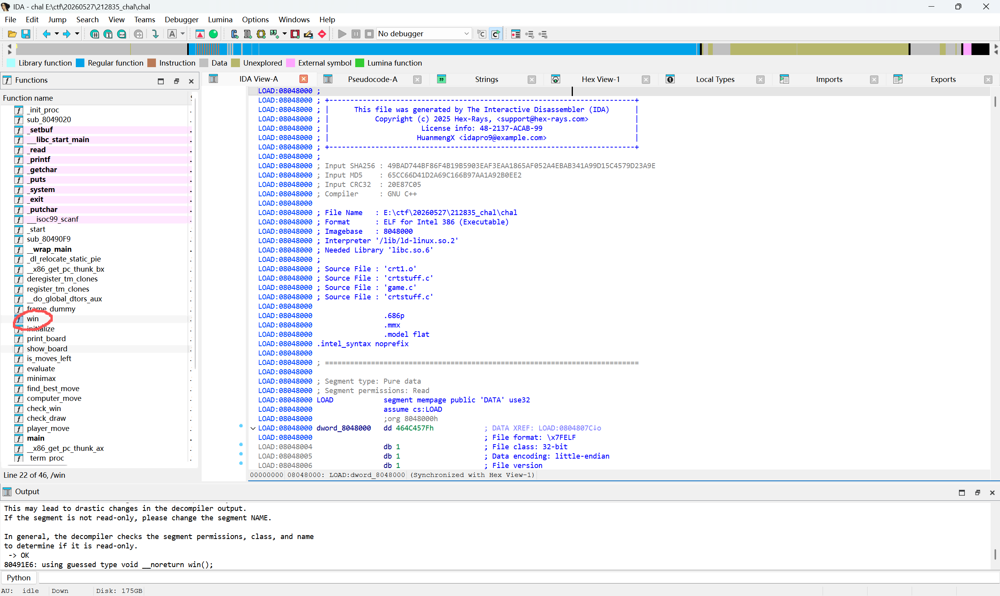

| 题目类型 | 题目名 | 难度 |
| :--- | :--- | :--- |
| Reverse | [adctf-2025] 测测你的环境 | 签到 |
| Reverse | [adctf-2025] ezenc | Normal |
| Pwm | [adctf-2025] 井字棋 | Easy |

## 思路：

### [adctf-2025] 测测你的环境

这里是题目给出的代码
```c
#include <stdio.h>
#include <stdlib.h>

char flag_enc[38] = {
    0x9d,0xd6,0x38,0x70,0x07,0x53,0xe6,0x84,0x70,0x38,0x83,0x1e,0x08,0x79,0xed,0x03,0x1b,0x4c,0x9f,0x3f,0x91,0xdf,0xc9,0x45,0x8d,0x19,0x43,0xfb,0x97,0xc2,0x02,0x39,0xda,0xd5,0x66,0x07,0xbd,0xe5
};

int main(void) {
    srand(2025);
    printf("This is the first part of flag:\n");
    for (int i = 0; i < 19; i++) {
        char decoded_char = flag_enc[i] ^ (rand() % 256);
        printf("%c", decoded_char);
    }
    printf("\n");
    printf("This is the second part of flag:\n");
    for (int i = 19; i < 38; i++) {
        char decoded_char = flag_enc[i] ^ (rand() % 256);
        printf("%c", decoded_char);
    }
    printf("\n");
    printf("Tips: If you see some non-printable characters, try to run the program on different platforms.\n");
}
```

第一次尝试在windows平台利用MingGW的编译器编译后，输出了：
```
This is the first part of flag:
flag{r@nd_d1ff_0n_d
This is the second part of flag:
���e��u�}x4iخ;-
Tips: If you see some non-printable characters, try to run the program on different platforms.
```

可以看到第二段flag是一串乱码。

题目说了尝试更换平台进行尝试

第二次尝试在linux(ubuntu)平台利用ubuntu的gcc进行编译尝试，输出了：
```
This is the first part of flag:
�ؗ���b�B@IVȗ�?|
This is the second part of flag:
Iff3r9n7_pl4tf0rm5}
Tips: If you see some non-printable characters, try to run the program on different platforms.
```

于是得到了flag的完全体：
```
flag{r@nd_d1ff_0n_dIff3r9n7_pl4tf0rm5}
```

思考🤔：为什么会有这样的差异

根据ChatGPT大人的指导，锁定了以下可能的原因：

1. 编译器默认char 为 unsigned char 或 signed char 导致的差异
2. 不同编译器的随机数算法不同

于是有了以下测试代码

代码：
```c
#include <stdio.h>
#include <stdlib.h>
#include <limits.h>
#include <ctype.h>

char flag_enc[38] = {
    0x9d,0xd6,0x38,0x70,0x07,0x53,0xe6,0x84,0x70,0x38,
    0x83,0x1e,0x08,0x79,0xed,0x03,0x1b,0x4c,0x9f,0x3f,
    0x91,0xdf,0xc9,0x45,0x8d,0x19,0x43,0xfb,0x97,0xc2,
    0x02,0x39,0xda,0xd5,0x66,0x07,0xbd,0xe5
};

int main(void) {
    printf("CHAR_MIN = %d\n", CHAR_MIN);
    printf("CHAR_MAX = %d\n\n", CHAR_MAX);

    srand(2025);

    printf("idx | enc_hex | enc_signed | enc_unsigned | rand | decoded_hex | decoded_signed | decoded_char\n");
    printf("----+---------+------------+--------------+------+-------------+----------------+-------------\n");

    for (int i = 0; i < 38; i++) {
        int r = rand() % 256;

        char enc_char = flag_enc[i];
        signed char enc_signed = (signed char)flag_enc[i];
        unsigned char enc_unsigned = (unsigned char)flag_enc[i];

        char decoded_char = enc_char ^ r;
        signed char decoded_signed = (signed char)decoded_char;
        unsigned char decoded_unsigned = (unsigned char)decoded_char;

        printf("%3d |   0x%02x  | %10d | %12u | %4d |     0x%02x    | %14d | ",
               i,
               enc_unsigned,
               enc_signed,
               enc_unsigned,
               r,
               decoded_unsigned,
               decoded_signed);

        if (decoded_unsigned >= 0x20 && decoded_unsigned <= 0x7e) {
            printf("%c", decoded_unsigned);
        } else {
            printf(".");
        }

        if (i == 18) {
            printf("   <-- first part end");
        }

        printf("\n");
    }

    printf("\nDecoded as chars:\n");

    srand(2025);
    for (int i = 0; i < 38; i++) {
        unsigned char enc = (unsigned char)flag_enc[i];
        unsigned char decoded = enc ^ (rand() % 256);

        if (i == 19) {
            printf("\n");
        }

        printf("%c", decoded);
    }

    printf("\n");

    return 0;
}
```

windows输出：
```
CHAR_MIN = -128
CHAR_MAX = 127

idx | enc_hex | enc_signed | enc_unsigned | rand | decoded_hex | decoded_signed | decoded_char
----+---------+------------+--------------+------+-------------+----------------+-------------
  0 |   0x9d  |        -99 |          157 |  251 |     0x66    |            102 | f
  1 |   0xd6  |        -42 |          214 |  186 |     0x6c    |            108 | l
  2 |   0x38  |         56 |           56 |   89 |     0x61    |             97 | a
  3 |   0x70  |        112 |          112 |   23 |     0x67    |            103 | g
  4 |   0x07  |          7 |            7 |  124 |     0x7b    |            123 | {
  5 |   0x53  |         83 |           83 |   33 |     0x72    |            114 | r
  6 |   0xe6  |        -26 |          230 |  166 |     0x40    |             64 | @
  7 |   0x84  |       -124 |          132 |  234 |     0x6e    |            110 | n
  8 |   0x70  |        112 |          112 |   20 |     0x64    |            100 | d
  9 |   0x38  |         56 |           56 |  103 |     0x5f    |             95 | _
 10 |   0x83  |       -125 |          131 |  231 |     0x64    |            100 | d
 11 |   0x1e  |         30 |           30 |   47 |     0x31    |             49 | 1
 12 |   0x08  |          8 |            8 |  110 |     0x66    |            102 | f
 13 |   0x79  |        121 |          121 |   31 |     0x66    |            102 | f
 14 |   0xed  |        -19 |          237 |  178 |     0x5f    |             95 | _
 15 |   0x03  |          3 |            3 |   51 |     0x30    |             48 | 0
 16 |   0x1b  |         27 |           27 |  117 |     0x6e    |            110 | n
 17 |   0x4c  |         76 |           76 |   19 |     0x5f    |             95 | _
 18 |   0x9f  |        -97 |          159 |  251 |     0x64    |            100 | d   <-- first part end
 19 |   0x3f  |         63 |           63 |   41 |     0x16    |             22 | .
 20 |   0x91  |       -111 |          145 |   94 |     0xcf    |            -49 | .
 21 |   0xdf  |        -33 |          223 |   54 |     0xe9    |            -23 | .
 22 |   0xc9  |        -55 |          201 |   56 |     0xf1    |            -15 | .
 23 |   0x45  |         69 |           69 |  193 |     0x84    |           -124 | .
 24 |   0x8d  |       -115 |          141 |  232 |     0x65    |            101 | e
 25 |   0x19  |         25 |           25 |  218 |     0xc3    |            -61 | .
 26 |   0x43  |         67 |           67 |  194 |     0x81    |           -127 | .
 27 |   0xfb  |         -5 |          251 |  253 |     0x06    |              6 | .
 28 |   0x97  |       -105 |          151 |  226 |     0x75    |            117 | u
 29 |   0xc2  |        -62 |          194 |   35 |     0xe1    |            -31 | .
 30 |   0x02  |          2 |            2 |  127 |     0x7d    |            125 | }
 31 |   0x39  |         57 |           57 |   65 |     0x78    |            120 | x
 32 |   0xda  |        -38 |          218 |  238 |     0x34    |             52 | 4
 33 |   0xd5  |        -43 |          213 |  188 |     0x69    |            105 | i
 34 |   0x66  |        102 |          102 |  190 |     0xd8    |            -40 | .
 35 |   0x07  |          7 |            7 |  169 |     0xae    |            -82 | .
 36 |   0xbd  |        -67 |          189 |  134 |     0x3b    |             59 | ;
 37 |   0xe5  |        -27 |          229 |  200 |     0x2d    |             45 | -

Decoded as chars:
flag{r@nd_d1ff_0n_d
���e��u�}x4iخ;-
```

linux输出：
```
这里是LINUX平台的：
CHAR_MIN = -128
CHAR_MAX = 127

idx | enc_hex | enc_signed | enc_unsigned | rand | decoded_hex | decoded_signed | decoded_char
----+---------+------------+--------------+------+-------------+----------------+-------------
  0 |   0x9d  |        -99 |          157 |  101 |     0xf8    |             -8 | .
  1 |   0xd6  |        -42 |          214 |   14 |     0xd8    |            -40 | .
  2 |   0x38  |         56 |           56 |  175 |     0x97    |           -105 | .
  3 |   0x70  |        112 |          112 |  199 |     0xb7    |            -73 | .
  4 |   0x07  |          7 |            7 |  174 |     0xa9    |            -87 | .
  5 |   0x53  |         83 |           83 |  162 |     0xf1    |            -15 | .
  6 |   0xe6  |        -26 |          230 |  132 |     0x62    |             98 | b
  7 |   0x84  |       -124 |          132 |   32 |     0xa4    |            -92 | .
  8 |   0x70  |        112 |          112 |   50 |     0x42    |             66 | B
  9 |   0x38  |         56 |           56 |  120 |     0x40    |             64 | @
 10 |   0x83  |       -125 |          131 |  202 |     0x49    |             73 | I
 11 |   0x1e  |         30 |           30 |   72 |     0x56    |             86 | V
 12 |   0x08  |          8 |            8 |   29 |     0x15    |             21 | .
 13 |   0x79  |        121 |          121 |  177 |     0xc8    |            -56 | .
 14 |   0xed  |        -19 |          237 |  122 |     0x97    |           -105 | .
 15 |   0x03  |          3 |            3 |  239 |     0xec    |            -20 | .
 16 |   0x1b  |         27 |           27 |  180 |     0xaf    |            -81 | .
 17 |   0x4c  |         76 |           76 |  115 |     0x3f    |             63 | ?
 18 |   0x9f  |        -97 |          159 |  227 |     0x7c    |            124 | |   <-- first part end
 19 |   0x3f  |         63 |           63 |  118 |     0x49    |             73 | I
 20 |   0x91  |       -111 |          145 |  247 |     0x66    |            102 | f
 21 |   0xdf  |        -33 |          223 |  185 |     0x66    |            102 | f
 22 |   0xc9  |        -55 |          201 |  250 |     0x33    |             51 | 3
 23 |   0x45  |         69 |           69 |   55 |     0x72    |            114 | r
 24 |   0x8d  |       -115 |          141 |  180 |     0x39    |             57 | 9
 25 |   0x19  |         25 |           25 |  119 |     0x6e    |            110 | n
 26 |   0x43  |         67 |           67 |  116 |     0x37    |             55 | 7
 27 |   0xfb  |         -5 |          251 |  164 |     0x5f    |             95 | _
 28 |   0x97  |       -105 |          151 |  231 |     0x70    |            112 | p
 29 |   0xc2  |        -62 |          194 |  174 |     0x6c    |            108 | l
 30 |   0x02  |          2 |            2 |   54 |     0x34    |             52 | 4
 31 |   0x39  |         57 |           57 |   77 |     0x74    |            116 | t
 32 |   0xda  |        -38 |          218 |  188 |     0x66    |            102 | f
 33 |   0xd5  |        -43 |          213 |  229 |     0x30    |             48 | 0
 34 |   0x66  |        102 |          102 |   20 |     0x72    |            114 | r
 35 |   0x07  |          7 |            7 |  106 |     0x6d    |            109 | m
 36 |   0xbd  |        -67 |          189 |  136 |     0x35    |             53 | 5
 37 |   0xe5  |        -27 |          229 |  152 |     0x7d    |            125 | }

Decoded as chars:
�ؗ���b�B@IVȗ�?|
Iff3r9n7_pl4tf0rm5}
```

通过对比，不难发现，不同平台使用srand(2025)，输出的rand序列不同，那么显然猜想2成立，结果是不同编译器的srand算法不同，导致随机数加密后的序列不同

出题者使用了**异或加密**，使用了两种编译器，分别对first part 和 second part的序列加密，并且利用了不同编译器srand()算法不同，最终导致了不能只使用一个编译平台得出结果。

最后提一嘴，理论上不需要linux也可以实现，更换编译器尝试应该就可以了。


### [adctf-2025] ezenc

这是一道逆向题，题目给出了一个两个ezenc文件，因为我们是windows平台，研究ezenc.exe即可，另一个为linux平台的二进制程序

在逆向之前，先不妨熟悉一些 IDA 常用快捷键：

| 按键 | 操作 |
| :--- | :--- |
| `Space` | 切换 **Graph View / Text View** |
| `Shift + F12` | 打开 **Strings 字符串窗口** |
| `F5` | 打开 **Hex-Rays 伪 C 代码** |
| `X` | 查看交叉引用 Xref |
| `Ctrl + F5` | 刷新反编译结果 |
| `N` | 重命名函数、变量、地址 |
| `Y` | 修改变量或函数类型 |
| `;` | 添加注释 |
| `Esc` | 返回上一个位置 |
| `G` | 跳转到指定地址 |
| `Enter` | 跳转到当前符号/地址 |
| `A` | 将数据定义为字符串 |
| `C` | 强制识别为代码 |
| `D` | 强制识别为数据 |
| `*` | 定义数组 |
| `Alt + B` | 搜索字节序列 |
| `Ctrl + F` | 当前窗口内搜索 |
| `F2` | 设置/取消断点 |
| `F7` | 单步步入 |
| `F8` | 单步步过 |
| `F9` | 开始/继续运行 |
| `F4` | 运行到光标处 |

对于一个程序，我们肯定要先找到它主函数的位置(或者更严谨一点，找到```主逻辑```函数)，点击运行ezenc.exe，提示我们输入一串字符："please input your flag"

那么我们大概率可以在字符串视图中找到该字符串，然后因为这是一个小程序，这一段print大概是在主逻辑函数里面的，所以我们只需定位什么函数用了该字符串即可。







观察代码
```c
__int64 sub_140001000()
{
  FILE *v0; // rax
  unsigned int v2; // [rsp+3Ch] [rbp-44h]
  unsigned int v3; // [rsp+4Ch] [rbp-34h]
  char Str[48]; // [rsp+50h] [rbp-30h] BYREF
  _BYTE v5[40]; // [rsp+80h] [rbp+0h] BYREF
  unsigned __int64 v6; // [rsp+A8h] [rbp+28h]

  sub_140001880();
  v6 = (unsigned __int64)v5 ^ unk_140006030;
  puts("please input your flag:");
  v0 = __acrt_iob_func(0);
  fgets(Str, 80, v0);
  if ( strcspn(Str, "\r\n") == 64 )
  {
    v2 = sub_140001120(Str, 64);
    sub_140001190(Str, 64, v2);
    if ( (unsigned int)sub_140002270(Str, &unk_140003030, 64) )
    {
      puts("incorrect.");
      v3 = 1;
    }
    else
    {
      puts("correct!");
      v3 = 0;
    }
  }
  else
  {
    puts("length mismatch.");
    v3 = 1;
  }
  if ( unk_140006030 != ((unsigned __int64)v5 ^ v6) )
    sub_1400022B0();
  return v3;
}
```

尝试分析代码：

这里应该是输入部分，从标准输入流中读取到Str，同时限制了输入长度
```c
puts("please input your flag:");
v0 = __acrt_iob_func(0);
fgets(Str, 80, v0);
```

这里有逻辑判断，不难看出这是一个长度判断，结合后续有 incorrect 和 correct，可见这应该是对flag的判断。同时，我们得知flag的长度应该为64
```cpp
if ( strcspn(Str, "\r\n") == 64 )
```

继续看校验流程：
```c
v2 = sub_140001120(Str, 64);
sub_140001190(Str, 64, v2);
if ( (unsigned int)sub_140002270(Str, &unk_140003030, 64) )
```
可以看到这里通过输入的flag，利用sub_140001120这个函数得到了v2，然后sub_140001190这个函数使用Str,v2进行了操作、后续sub_140002270(Str, &unk_140003030, 64)则大概率是一个比较函数，用于确认某些东西。

进一步分析sub_140001120,sub140001190,sub_140002270:

通过点击对应函数跳转，我们看到了:
```c
__int64 __fastcall sub_140001120(unsigned __int8 *a1, __int64 a2)
{
  unsigned __int8 *v3; // rcx
  unsigned int i; // [rsp+4h] [rbp-1Ch]

  for ( i = 5381; a2--; i = *v3 + 33 * i )
    v3 = a1++;
  return i;
}

_BYTE *__fastcall sub_140001190(_BYTE *a1, unsigned __int64 a2, unsigned int a3)
{
  _BYTE *result; // rax
  char v4; // cl
  _BYTE *v5; // rax
  unsigned __int8 v6; // [rsp+0h] [rbp-30h]
  unsigned __int8 v7; // [rsp+Fh] [rbp-21h]
  unsigned int v8; // [rsp+10h] [rbp-20h]
  unsigned __int8 i; // [rsp+17h] [rbp-19h]
  _BYTE *v10; // [rsp+18h] [rbp-18h]

  result = a1;
  v10 = a1;
  v7 = 0;
  while ( a2 )
  {
    v8 = a3;
    if ( a2 <= 4 )
      v6 = a2;
    else
      v6 = 4;
    for ( i = 0; i < (int)v6; ++i )
    {
      v4 = v8 ^ *v10;
      v5 = v10++;
      *v5 = v4;
      v8 >>= 8;
    }
    a2 -= v6;
    v7 = (v7 + 5) % 32;
    result = (_BYTE *)(a3 ^ ((1 << v7) | __ROL4__(a3, v7)));
    a3 = (unsigned int)result;
  }
  return result;
}

__int64 __fastcall sub_140002270(__int64 a1, __int64 a2, __int64 a3)
{
  __int64 v3; // r9
  __int64 result; // rax

  if ( !a3 )
    return 0;
  v3 = 0;
  while ( 1 )
  {
    result = *(unsigned __int8 *)(a1 + v3) - (unsigned int)*(unsigned __int8 *)(a2 + v3);
    if ( (_DWORD)result )
      break;
    if ( a3 == ++v3 )
      return 0;
  }
  return result;
}
```

经过观察，sub_140002270()，不难发现这是一个比较函数，那么&unk_140003030大概率也是一个字符串，且大概率是一个加密flag。同时，不难猜测sub_140001120，sub_140001190在做加密操作。那我们现在只需知道&unk_140003030指向了什么样的字符串，逆向sub_140001120，sub_140001190这个转换函数，大概率能得到flag的推导逻辑。

点击&unk_140003030,跳转：


小知识：

在IDA中，十六进制数的格式为xxh，或者0xxh。后者带0前缀的版本是为了防止歧义。

因为在汇编语法里，如果十六进制数以字母开头，可能会被当成符号名，而不是数字。

于是我们知道了encrypted_flag为：

```
unsigned char target[64] = {
    0x7C, 0x51, 0x12, 0x26, 0x09, 0xDE, 0x4B, 0x19,
    0xFD, 0x21, 0x34, 0x62, 0x0B, 0xFC, 0xC7, 0xE4,
    0xE5, 0xB6, 0x4C, 0x26, 0x91, 0xC1, 0xC7, 0xDE,
    0x18, 0x9E, 0xAF, 0x67, 0x17, 0xF8, 0x22, 0xD3,
    0xD5, 0x88, 0xBA, 0xA5, 0x92, 0x47, 0x94, 0x52,
    0x72, 0x7E, 0x0E, 0x65, 0x36, 0x70, 0xC7, 0x2F,
    0xB1, 0x34, 0x12, 0x7B, 0x20, 0x9E, 0xD3, 0x4E,
    0xB6, 0x36, 0xEA, 0x29, 0xF2, 0xB2, 0xEA, 0xFE
};
```

继续看sub_140001120()函数：
```c
__int64 __fastcall sub_140001120(unsigned __int8 *a1, __int64 a2)
{
  unsigned __int8 *v3;
  unsigned int i;

  for ( i = 5381; a2--; i = *v3 + 33 * i )
    v3 = a1++;
  return i;
}
```

它的逻辑：

初始值 5381

每次 hash = hash * 33 + 当前字符

这是经典的 **DJB2 hash**

于是我们知道了v2 = djb2_hash(Str, 64) ⇔ key = hash(原始输入)

c++代码演示：
```cpp
#include <cstdint>
#include <cstddef>

uint32_t djb2_hash(const uint8_t* data, size_t len) {
    uint32_t hash = 5381;

    for (size_t i = 0; i < len; ++i) {
        hash = hash * 33 + data[i];
    }

    return hash;
}
```

现在分析sub_140001190()，这里是核心：
```c
v8 = a3;
    if ( a2 <= 4 )
      v6 = a2;
    else
      v6 = 4;
    for ( i = 0; i < (int)v6; ++i )
    {
      v4 = v8 ^ *v10;
      v5 = v10++;
      *v5 = v4;
      v8 >>= 8;
    }
    a2 -= v6;
    v7 = (v7 + 5) % 32;
    result = (_BYTE *)(a3 ^ ((1 << v7) | __ROL4__(a3, v7)));
    a3 = (unsigned int)result;
```
a3是上面得到的key，然后代码的意思是：

每次取 key 的低 8 位，与当前字符 XOR

然后 key 右移 8 位，处理下一个字符

又key为32位，所以一轮处理4个字符。

处理完一组，就会更新key。

c++代码演示：
```cpp
#include <cstdint>
#include <cstddef>

uint32_t rol32(uint32_t value, unsigned int shift) {
    shift &= 31;
    return (value << shift) | (value >> (32 - shift));
}

void encrypt(uint8_t* data, size_t len, uint32_t key) {
    uint8_t shift = 0;
    size_t pos = 0;

    while (len > 0) {
        uint32_t current_key = key;

        uint8_t block_size;
        if (len <= 4) {
            block_size = static_cast<uint8_t>(len);
        } else {
            block_size = 4;
        }

        for (uint8_t i = 0; i < block_size; ++i) {
            data[pos] ^= static_cast<uint8_t>(current_key & 0xFF);
            current_key >>= 8;
            ++pos;
        }

        len -= block_size;

        shift = static_cast<uint8_t>((shift + 5) % 32);
        key = key ^ ((1u << shift) | rol32(key, shift));
    }
}
```

此时，整个加密逻辑变成了：
```
key = djb2(flag)
cipher = flag XOR keystream(key)
cipher == unk_140003030 ?
```

此时，我们发现，我们必须知道key，但是我们无法得知key是什么

此时突破口是CTF flag的格式："flag{xxxxxxxxxx}"

已知密文前4个字节为
```
7C 51 12 26
```

明文前4字节：
```
f  l  a  g
66 6C 61 67
```

于是反推key的四个字节：
```
key_byte = cipher_byte XOR plain_byte
7C ^ 66 = 1A
51 ^ 6C = 3D
12 ^ 61 = 73
26 ^ 67 = 41
```

由于加密是低字节先用，且windows程序为小端序，所以：
```
key = 0x41733d1a
```

使用python解密：
```python
def rol32(x, r):
    x &= 0xFFFFFFFF
    r &= 31
    return ((x << r) | (x >> (32 - r))) & 0xFFFFFFFF


def djb2_hash(data: bytes) -> int:
    h = 5381
    for b in data:
        h = (h * 33 + b) & 0xFFFFFFFF
    return h


def decrypt_with_key(cipher: bytes, key: int) -> bytes:
    data = bytearray(cipher)

    shift = 0
    pos = 0
    length = len(data)

    while length > 0:
        current_key = key
        block_size = min(length, 4)

        for _ in range(block_size):
            data[pos] ^= current_key & 0xFF
            current_key >>= 8
            pos += 1

        length -= block_size

        shift = (shift + 5) % 32
        key = (key ^ ((1 << shift) | rol32(key, shift))) & 0xFFFFFFFF

    return bytes(data)


cipher = bytes([
    0x7C, 0x51, 0x12, 0x26, 0x09, 0xDE, 0x4B, 0x19,
    0xFD, 0x21, 0x34, 0x62, 0x0B, 0xFC, 0xC7, 0xE4,
    0xE5, 0xB6, 0x4C, 0x26, 0x91, 0xC1, 0xC7, 0xDE,
    0x18, 0x9E, 0xAF, 0x67, 0x17, 0xF8, 0x22, 0xD3,
    0xD5, 0x88, 0xBA, 0xA5, 0x92, 0x47, 0x94, 0x52,
    0x72, 0x7E, 0x0E, 0x65, 0x36, 0x70, 0xC7, 0x2F,
    0xB1, 0x34, 0x12, 0x7B, 0x20, 0x9E, 0xD3, 0x4E,
    0xB6, 0x36, 0xEA, 0x29, 0xF2, 0xB2, 0xEA, 0xFE
])

# 已知 flag 通常以 "flag" 开头
known_plain = b"flag"

# 加密函数前 4 字节直接使用初始 key 的 4 个低位字节异或
key_bytes = bytes(c ^ p for c, p in zip(cipher[:4], known_plain))

# 小端序还原 32 位 key
key = int.from_bytes(key_bytes, "little")

print(f"key = 0x{key:08x}")

flag = decrypt_with_key(cipher, key)

print(flag.decode())

# 验证：这个 key 应该等于 djb2(flag)
hash_value = djb2_hash(flag)

print(f"djb2(flag) = 0x{hash_value:08x}")

if hash_value == key:
    print("check passed")
else:
    print("check failed")
```


然后就能得到:
```
flag{@_v3rY_s1Mp13_eNcR7pT_t7aT_y0U_c@n_kN0w7_p1@iNt3x7_aT7Ack!}
```

### [adctf-2025] 井字棋

题目给了一个文件，但是没有任何后缀，所以我们先鉴定一下文件类型

这方面就得请出linux大哥了，虚拟机，启动！！！

```bash
feng-gjsnw@feng-gjsnw-VMware-Virtual-Platform:~/桌面/ctf/pwn-下棋$ ls -la
total 28
drwxrwxr-x 2 feng-gjsnw feng-gjsnw  4096 May 27 21:43 .
drwxrwxr-x 5 feng-gjsnw feng-gjsnw  4096 May 27 21:42 ..
-rwxrwxrwx 1 feng-gjsnw feng-gjsnw 15688 May 27 21:29 chal

feng-gjsnw@feng-gjsnw-VMware-Virtual-Platform:~/桌面/ctf/pwn-下棋$ file *
chal:   ELF 32-bit LSB executable, Intel i386, version 1 (SYSV), dynamically linked, interpreter /lib/ld-linux.so.2, BuildID[sha1]=4fb6b9c7fe0badb5afeb9f9081b23c7f260a643e, for GNU/Linux 3.2.0, not stripped
```

看到了ELF 64-bit LSB executable，说明这是一个linux的可执行程序。

如果是PE32 executable，那则是windows程序。

然后，注意到Intel i386,说明这是x86-64程序，知道这个有利于后期可能的汇编分析。

还有not stripped，说明符号表还在，能在IDA里面直接看到函数名。

使用
```bash
feng-gjsnw@feng-gjsnw-VMware-Virtual-Platform:~/桌面/ctf/pwn-下棋$ ./chal
```
进入游戏



正常游玩后...



根据井字棋的游戏规则和经典的博弈论，显然你只能平局或故意输（双方采取最优策略），所以不可能赢从而获取flag。

那应该怎么办呢🤔

事已至此，先用IDA逆个向。




## 感言：
